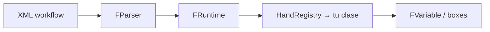

# Cómo crear un hand

> 🌐 **Español** · [English](how-to-create-a-hand.md)

> **Un hand = un tag XML + una clase Python.**  
> El motor no se reescribe: registras la lógica, pruebas el comportamiento, regeneras el schema y listo.

Francis Suite ya es **funcional** para pipelines reales. Cuando necesitas una capacidad nueva — leer un formato, llamar a un servicio, transformar datos — la sumas como **hand** y el resto del framework (parser, runtime, boxes, records, expresiones) sigue igual.

---

## En 30 segundos



| Paso | Qué haces | Dónde |
|------|-----------|--------|
| 1 | Escribir la clase con `@hand(tag="...")` | `francis_suite/hands/core/` |
| 2 | Importar el módulo | `francis_suite/hands/core/__init__.py` |
| 3 | Probar con `pytest` | `tests/` |
| 4 | Regenerar schema | `francis-suite schema --out schema` |
| 5 | Usar el tag en tu workflow | `workflows/*.xml` |

---

## Qué es un hand

- En el **XML** aparece como un tag, por ejemplo `<compose>`, `<httpx-call>`, `<record-save>`.
- En **Python** es una clase que hereda de `AbstractHand` y implementa `execute()`.
- Al arrancar el runtime, el decorador `@hand` registra el tag en `HandRegistry`.
- `execute()` **siempre** devuelve una `FVariable` (`FNodeVariable`, `FListVariable`, `FEmptyVariable`, etc.).

Referencias en el repo:

- Base: [`francis_suite/hands/base.py`](../../francis_suite/hands/base.py)
- Ejemplo mínimo: [`francis_suite/hands/core/log.py`](../../francis_suite/hands/core/log.py)
- Ejemplo con atributos + hijos: [`francis_suite/hands/core/httpx_call.py`](../../francis_suite/hands/core/httpx_call.py)

---

## Paso 1 — Crear el archivo Python

Convención: `francis_suite/hands/core/mi_hand.py` (snake_case) y tag XML en kebab-case: `mi-hand`.

Plantilla lista para copiar:

```python
"""
hands/core/mi-hand.py

MiHand implements the <mi-hand> tag.
Short description of what it does.

Usage in XML:
    <box-def name="resultado">
        <mi-hand prefijo="hola">
            <box name="entrada"/>
        </mi-hand>
    </box-def>
"""

from __future__ import annotations

from francis_suite.core.expressions import FrancisExpression
from francis_suite.core.registry import hand
from francis_suite.core.variables import FEmptyVariable, FNodeVariable, FVariable
from francis_suite.hands.base import AbstractHand


@hand(tag="mi-hand")
class MiHand(AbstractHand):
    """
    One-line summary for maintainers.

    Attributes:
        prefijo (optional): text prepended to the result. Default: "".

    Returns:
        FNodeVariable with the processed text.
        FEmptyVariable if there is nothing to return.

  Example:
        <mi-hand prefijo="ID: ">
            <box name="external_id"/>
        </mi-hand>
    """

    def execute(self) -> FVariable:
        engine = FrancisExpression(self.context)
        prefijo = engine.resolve(self.attr("prefijo", ""))

        if self.has_children():
            contenido = self.execute_children().to_string()
        else:
            contenido = self.resolve_body_text()

        if not contenido.strip():
            return FEmptyVariable()

        return FNodeVariable(f"{prefijo}{contenido}")
```

### Patrones comunes en `execute()`

**Solo texto del tag (sin hijos):**

```xml
<compose>book-${contador}</compose>
```

```python
texto = self.resolve_body_text()
```

**Entrada desde hijos (otro hand o `<box name="..."/>`):**

```xml
<convert-html-to-xml>
    <box name="pagina_html"/>
</convert-html-to-xml>
```

```python
if self.has_children():
    resultado = self.execute_children()
    raw = resultado.to_string()
```

**Atributos que el usuario puede parametrizar con `${...}`:**

```python
engine = FrancisExpression(self.context)
url = engine.resolve(self.require_attr("url"))
timeout_ms = engine.resolve(self.attr("timeout", "30000"))
```

---

## Paso 2 — Registrar el hand en el core

El runtime solo conoce los hands que se importan al cargar el paquete. Agrega **una línea** en [`francis_suite/hands/core/__init__.py`](../../francis_suite/hands/core/__init__.py):

```python
from francis_suite.hands.core import mi_hand
```

Sin este import, el tag `<mi-hand>` fallará en ejecución con *unknown tag* aunque el archivo exista.

> **Nota:** `hands/ext/` para plugins externos está en el [roadmap](../roadmap.md); hoy todas las hands integradas viven en `hands/core/`.

---

## Paso 3 — Usarlo en un workflow XML

```xml
<?xml version="1.0" encoding="UTF-8"?>
<francis-workflow>

    <shared-box-def name="external_id" replace="true">A001</shared-box-def>

    <box-def name="etiqueta">
        <mi-hand prefijo="Propiedad ">
            <box name="external_id"/>
        </mi-hand>
    </box-def>

    <log>${etiqueta}</log>

</francis-workflow>
```

Prueba en local:

```bash
uv run francis-suite run ruta/a/tu_workflow.xml
```

---

## Paso 4 — Escribir un test

Los tests aseguran que el hand se comporta como documentas. Patrón mínimo (igual que en [`tests/test_pipeline.py`](../../tests/test_pipeline.py)):

```python
def test_mi_hand_executes():
    xml = """
    <francis-workflow>
        <box-def name="resultado">
            <mi-hand prefijo="OK: ">valor</mi-hand>
        </box-def>
    </francis-workflow>
    """

    parser = FParser()
    runtime = FRuntime()
    root = parser.parse_string(xml)
    session = runtime.run(root, workflow_name="test-mi-hand")

    assert session.status == SessionStatus.COMPLETED
    assert session.context.get("resultado").to_string() == "OK: valor"
```

Ejecutar:

```bash
uv sync --extra dev
uv run pytest tests/test_pipeline.py -k mi_hand -v
```

---

## Paso 5 — Schema y editor (VS Code / Cursor)

Cada hand nuevo debe aparecer en el schema para autocompletado de tags.

```bash
uv run francis-suite schema --out schema
```

Eso actualiza:

- `schema/francis-workflow.schema.json` — lista de tags registrados
- `schema/francis-workflow.xsd` — validación básica en el IDE

Guía completa del schema: [workflow-schema.md](workflow-schema.md).  
Snippets y XSD enriquecido (atributos por hand): [xml-tooling.md](../xml-tooling.md) — **Escenario A**.

Incluye en el **commit** el código (`mi_hand.py`, `__init__.py`, test) y los archivos en `schema/` si regeneraste.

---

## Reglas que no puedes saltear

Resumen de [`AbstractHand`](../../francis_suite/hands/base.py). Detalle en [sensitive.md](sensitive.md).

| Regla | Qué implica |
|-------|-------------|
| **1 — `engine.resolve()`** | Cualquier atributo que el usuario escriba como `${variable}` (`url`, `path`, `expression`, …) debe resolverse antes de usarse. |
| **2 — Scoping** | `while` y `loop` **no** abren scope nuevo; `function-call` **sí**. Si no tocas una box, no cambia. |
| **3 — Sensibles** | En logs/UI: `resolve_body_text_display()` o `engine.resolve_display()`. Nunca mostrar secretos con `resolve_body_text()` solo. |
| **4 — Portabilidad** | Rutas con `pathlib.Path`; UTF-8 al leer/escribir; sin comandos solo de un OS. |
| **5 — Nombres claros** | Atributos autodescriptivos: `search-in-subfolders`, `clean-data`, `to` (no `dest`). |

---

## Checklist antes del PR

- [ ] Clase con `@hand(tag="...")` y docstring con atributos + ejemplo XML
- [ ] Import en `hands/core/__init__.py`
- [ ] Test en `tests/` que pase con `uv run pytest`
- [ ] `uv run francis-suite schema --out schema` y commit de `schema/` si cambió
- [ ] Atributos dinámicos pasan por `FrancisExpression.resolve()`
- [ ] Logs no filtran tokens/passwords
- [ ] (Opcional) Snippet en `tools/vscode/francis-suite.code-snippets` — ver [xml-tooling.md](../xml-tooling.md)

---

## Siguiente lectura

| Documento | Para qué |
|-----------|----------|
| [architecture.md](../architecture.md) | Capas, FNode, FContext, lista de hands |
| [workflow-schema.md](workflow-schema.md) | XSD y manifest |
| [xml-tooling.md](../xml-tooling.md) | Mantener IDE al día |
| [roadmap.md](../roadmap.md) | Hands planificadas y `hands/ext/` a futuro |

---

*¿Dudas con un hand concreto? Mira un hand parecido en `francis_suite/hands/core/` y copia su estructura — el framework ya tiene decenas de ejemplos reales.*
