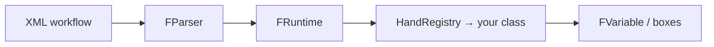

# How to create a hand

> 🌐 **English** · [Español](como-crear-un-hand.md)

> **A hand = one XML tag + one Python class.**
> The engine isn't rewritten: you register the logic, test it, regenerate the schema, and you're done.

Francis Suite is already **functional** for real pipelines. When you need a new capability — read a format, call a service, transform data — you add it as a **hand** and the rest of the framework (parser, runtime, boxes, records, expressions) stays the same.

---

## In 30 seconds



| Step | What you do | Where |
|------|-------------|--------|
| 1 | Write the class with `@hand(tag="...")` | `francis_suite/hands/core/` |
| 2 | Import the module | `francis_suite/hands/core/__init__.py` |
| 3 | Test with `pytest` | `tests/` |
| 4 | Regenerate the schema | `francis-suite schema --out schema` |
| 5 | Use the tag in your workflow | `workflows/*.xml` |

---

## What is a hand

- In the **XML** it appears as a tag — for example `<compose>`, `<httpx-call>`, `<record-save>`.
- In **Python** it's a class that inherits from `AbstractHand` and implements `execute()`.
- When the runtime starts, the `@hand` decorator registers the tag in `HandRegistry`.
- `execute()` **always** returns an `FVariable` (`FNodeVariable`, `FListVariable`, `FEmptyVariable`, etc.).

References in the repo:

- Base: [`francis_suite/hands/base.py`](../../francis_suite/hands/base.py)
- Minimal example: [`francis_suite/hands/core/log.py`](../../francis_suite/hands/core/log.py)
- Example with attributes + children: [`francis_suite/hands/core/httpx_call.py`](../../francis_suite/hands/core/httpx_call.py)

---

## Step 1 — Create the Python file

Convention: `francis_suite/hands/core/my_hand.py` (snake_case) and the XML tag in kebab-case: `my-hand`.

Ready-to-copy template:

```python
"""
hands/core/my-hand.py

MyHand implements the <my-hand> tag.
Short description of what it does.

Usage in XML:
    <box-def name="result">
        <my-hand prefix="hello">
            <box name="input"/>
        </my-hand>
    </box-def>
"""

from __future__ import annotations

from francis_suite.core.expressions import FrancisExpression
from francis_suite.core.registry import hand
from francis_suite.core.variables import FEmptyVariable, FNodeVariable, FVariable
from francis_suite.hands.base import AbstractHand


@hand(tag="my-hand")
class MyHand(AbstractHand):
    """
    One-line summary for maintainers.

    Attributes:
        prefix (optional): text prepended to the result. Default: "".

    Returns:
        FNodeVariable with the processed text.
        FEmptyVariable if there is nothing to return.

    Example:
        <my-hand prefix="ID: ">
            <box name="external_id"/>
        </my-hand>
    """

    def execute(self) -> FVariable:
        engine = FrancisExpression(self.context)
        prefix = engine.resolve(self.attr("prefix", ""))

        if self.has_children():
            content = self.execute_children().to_string()
        else:
            content = self.resolve_body_text()

        if not content.strip():
            return FEmptyVariable()

        return FNodeVariable(f"{prefix}{content}")
```

### Common patterns inside `execute()`

**Only text inside the tag (no children):**

```xml
<compose>book-${counter}</compose>
```

```python
text = self.resolve_body_text()
```

**Input from children (another hand or `<box name="..."/>`):**

```xml
<convert-html-to-xml>
    <box name="page_html"/>
</convert-html-to-xml>
```

```python
if self.has_children():
    result = self.execute_children()
    raw = result.to_string()
```

**Attributes the user can parametrize with `${...}`:**

```python
engine = FrancisExpression(self.context)
url = engine.resolve(self.require_attr("url"))
timeout_ms = engine.resolve(self.attr("timeout", "30000"))
```

---

## Step 2 — Register the hand in the core

The runtime only knows about hands that are imported when the package loads. Add **one line** in [`francis_suite/hands/core/__init__.py`](../../francis_suite/hands/core/__init__.py):

```python
from francis_suite.hands.core import my_hand
```

Without this import, the `<my-hand>` tag will fail at runtime with *unknown tag* even if the file exists.

> **Note:** `hands/ext/` for external plugins is on the [roadmap](../roadmap.md); today all integrated hands live in `hands/core/`.

---

## Step 3 — Use it in a workflow XML

```xml
<?xml version="1.0" encoding="UTF-8"?>
<francis-workflow>

    <shared-box-def name="external_id" replace="true">A001</shared-box-def>

    <box-def name="label">
        <my-hand prefix="Property ">
            <box name="external_id"/>
        </my-hand>
    </box-def>

    <log>${label}</log>

</francis-workflow>
```

Run locally:

```bash
uv run francis-suite run path/to/your_workflow.xml
```

---

## Step 4 — Write a test

Tests ensure the hand behaves as you document it. Minimal pattern (same as in [`tests/test_pipeline.py`](../../tests/test_pipeline.py)):

```python
def test_my_hand_executes():
    xml = """
    <francis-workflow>
        <box-def name="result">
            <my-hand prefix="OK: ">value</my-hand>
        </box-def>
    </francis-workflow>
    """

    parser = FParser()
    runtime = FRuntime()
    root = parser.parse_string(xml)
    session = runtime.run(root, workflow_name="test-my-hand")

    assert session.status == SessionStatus.COMPLETED
    assert session.context.get("result").to_string() == "OK: value"
```

Run:

```bash
uv sync --extra dev
uv run pytest tests/test_pipeline.py -k my_hand -v
```

---

## Step 5 — Schema and editor (VS Code / Cursor)

Every new hand must appear in the schema for tag autocomplete.

```bash
uv run francis-suite schema --out schema
```

That updates:

- `schema/francis-workflow.schema.json` — list of registered tags
- `schema/francis-workflow.xsd` — basic validation in the IDE

Full schema guide: [workflow-schema.md](workflow-schema.md).
Snippets and enriched XSD (per-hand attributes): [xml-tooling.md](../xml-tooling.md) — **Scenario A**.

Include in the **commit** the code (`my_hand.py`, `__init__.py`, test) and the files in `schema/` if you regenerated.

---

## Rules you can't skip

Summary of [`AbstractHand`](../../francis_suite/hands/base.py). Detail in [sensitive.md](sensitive.md).

| Rule | What it implies |
|------|-----------------|
| **1 — `engine.resolve()`** | Any attribute the user can write as `${variable}` (`url`, `path`, `expression`, …) must be resolved before use. |
| **2 — Scoping** | `while` and `loop` do **not** open a new scope; `function-call` **does**. If you don't touch a box, it doesn't change. |
| **3 — Sensitive values** | In logs/UI: `resolve_body_text_display()` or `engine.resolve_display()`. Never show secrets with `resolve_body_text()` alone. |
| **4 — Portability** | Paths with `pathlib.Path`; UTF-8 for read/write; no OS-specific commands. |
| **5 — Clear names** | Self-describing attributes: `search-in-subfolders`, `clean-data`, `to` (not `dest`). |

---

## Checklist before the PR

- [ ] Class with `@hand(tag="...")` and a docstring with attributes + XML example
- [ ] Import in `hands/core/__init__.py`
- [ ] Test in `tests/` that passes with `uv run pytest`
- [ ] `uv run francis-suite schema --out schema` and commit of `schema/` if it changed
- [ ] Dynamic attributes go through `FrancisExpression.resolve()`
- [ ] Logs do not leak tokens/passwords
- [ ] (Optional) Snippet in `tools/vscode/francis-suite.code-snippets` — see [xml-tooling.md](../xml-tooling.md)

---

## Further reading

| Document | For |
|----------|-----|
| [architecture.md](../architecture.md) | Layers, FNode, FContext, hand list |
| [workflow-schema.md](workflow-schema.md) | XSD and manifest |
| [xml-tooling.md](../xml-tooling.md) | Keeping the IDE up to date |
| [roadmap.md](../roadmap.md) | Planned hands and future `hands/ext/` |

---

*Stuck on a specific hand? Look at a similar one in `francis_suite/hands/core/` and copy its structure — the framework already has dozens of real examples.*
